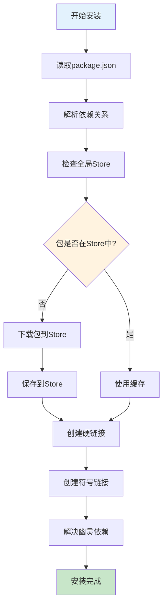

# mini-pnpm

一个简单版本的pnpm实现，支持以下核心功能：

## 功能特性

- ✅ **全局store管理** - 包被缓存在全局store中，避免重复下载
- ✅ **硬链接和符号链接** - 使用硬链接节省磁盘空间，符号链接构建依赖关系
- ✅ **幽灵依赖解决** - 通过.pnpm/node_modules解决间接依赖访问问题
- ✅ **依赖解析** - 支持版本范围解析（^, ~等）
- ✅ **命令行接口** - 提供简单的命令行工具
- ✅ **淘宝镜像支持** - 支持使用淘宝镜像加速下载
- ✅ **性能优化** - 限制依赖解析深度和包数量，大幅提升速度

## 安装

```bash
npm install
```

## 使用方法

### 安装依赖
```bash
# 从package.json安装依赖
node src/index.js install

# 使用淘宝镜像
node src/index.js install --registry taobao

# 限制依赖深度和包数量
node src/index.js install --registry taobao --max-depth 2 --max-packages 20
```

### 安装单个包
```bash
# 安装单个包
node src/index.js add lodash

# 安装指定版本
node src/index.js add lodash --package-version 4.17.21

# 使用淘宝镜像安装
node src/index.js add axios --registry taobao
```

### 查看store信息
```bash
node src/index.js store
```

### 运行测试
```bash
# 基础功能演示
npm test

# 性能优化演示
npm run test:performance
```

## 工作原理

1. **依赖解析**: 从package.json读取依赖，递归解析所有间接依赖
2. **全局缓存**: 检查包是否已在全局store中，如果没有则下载并缓存
3. **硬链接**: 从store创建硬链接到.pnpm目录
4. **符号链接**: 在node_modules根目录创建符号链接指向直接依赖
5. **幽灵依赖**: 在.pnpm/node_modules中创建符号链接解决间接依赖访问

## 目录结构

```
node_modules/
├── .pnpm/
│   ├── lodash@4.17.21/     # 硬链接到store
│   ├── axios@1.6.0/        # 硬链接到store
│   └── node_modules/       # 幽灵依赖符号链接
│       └── some-dep/       # 间接依赖的符号链接
├── lodash -> .pnpm/lodash@4.17.21
└── axios -> .pnpm/axios@1.6.0
```

## 与真实pnpm的区别

这是一个简化版本，主要区别：

- 版本解析相对简单
- 不支持workspace
- 不支持monorepo
- 错误处理相对基础
- 性能优化较少

## 开发

```bash
# 安装依赖
npm install

# 运行测试
npm test

# 在测试项目中安装依赖
cd test/test-project
node ../../src/index.js install
``` 

## 实现原理

### 核心模块实现

#### 1. Store管理 (store.js)

```javascript
// 全局Store路径
const STORE_PATH = path.join(os.homedir(), '.mini-pnpm', 'store');

// 生成包的store key
function getStoreKey(packageName, version) {
  const content = `${packageName}@${version}`;
  return crypto.createHash('sha256').update(content).digest('hex').substring(0, 8);
}

// 创建硬链接
async function createHardLink(source, target) {
  try {
    await fs.ensureDir(path.dirname(target));
    await fs.link(source, target);
    return true;
  } catch (error) {
    console.warn(`⚠️  Failed to create hard link: ${error.message}`);
    // 回退到复制
    await fs.copy(source, target);
    return false;
  }
}
```

#### 2. 依赖解析 (resolver.js)

```javascript
// 版本范围解析
function resolveVersionRange(versionRange, availableVersions) {
  if (versionRange === 'latest') return 'latest';
  if (versionRange === '*') return availableVersions[availableVersions.length - 1];
  
  // 处理 ^4.17.21 格式
  if (versionRange.startsWith('^')) {
    const cleanVersion = versionRange.replace(/^\^/, '');
    const [major, minor, patch] = cleanVersion.split('.').map(v => parseInt(v));
    
    let bestVersion = null;
    for (const version of availableVersions) {
      const [vMajor, vMinor, vPatch] = version.split('.').map(v => parseInt(v));
      if (vMajor === major && vMinor >= minor && vPatch >= patch) {
        if (!bestVersion || version > bestVersion) {
          bestVersion = version;
        }
      }
    }
    return bestVersion || availableVersions[availableVersions.length - 1];
  }
  
  return versionRange;
}
```

#### 3. 安装流程 (installer.js)

```javascript
async function install(options = {}) {
  // 1. 设置registry
  if (options.registry) {
    setRegistry(options.registry);
  }
  
  // 2. 确保store存在
  await ensureStoreExists();
  
  // 3. 获取项目依赖
  const projectDeps = await getProjectDependencies(projectPath);
  
  // 4. 解析依赖树
  const resolvedPackages = await resolveDependencies(projectDeps, new Map(), 0, {
    maxDepth: options.maxDepth || 3,
    maxPackages: options.maxPackages || 50
  });
  
  // 5. 创建node_modules结构
  const { nodeModulesPath, pnpmPath } = await createNodeModulesStructure(projectPath);
  
  // 6. 安装所有包
  for (const [packageKey, packageInfo] of resolvedPackages) {
    await installPackage(packageInfo, pnpmPath, nodeModulesPath);
  }
  
  // 7. 解决幽灵依赖
  await resolvePhantomDependencies(resolvedPackages, pnpmPath, nodeModulesPath);
}
```

### 安装流程图



## ⚡ 性能优化实践

### 1. 淘宝镜像支持

```javascript
const REGISTRY_CONFIG = {
  npm: 'https://registry.npmjs.org',
  taobao: 'https://registry.npmmirror.com'
};

function setRegistry(registry) {
  if (registry === 'taobao' || registry === 'npmmirror') {
    currentRegistry = REGISTRY_CONFIG.taobao;
  } else if (registry === 'npm') {
    currentRegistry = REGISTRY_CONFIG.npm;
  } else {
    currentRegistry = registry;
  }
}
```

### 2. 依赖深度限制

```javascript
async function resolveDependencies(packages, resolved = new Map(), depth = 0, options = {}) {
  const maxDepth = options.maxDepth || 3;
  const maxPackages = options.maxPackages || 50;
  
  if (depth > maxDepth) {
    console.warn(`⚠️  Maximum dependency depth reached (${maxDepth})`);
    return resolved;
  }
  
  if (resolved.size >= maxPackages) {
    console.warn(`⚠️  Maximum package count reached (${maxPackages})`);
    return resolved;
  }
  
  // 递归解析依赖...
}
```

